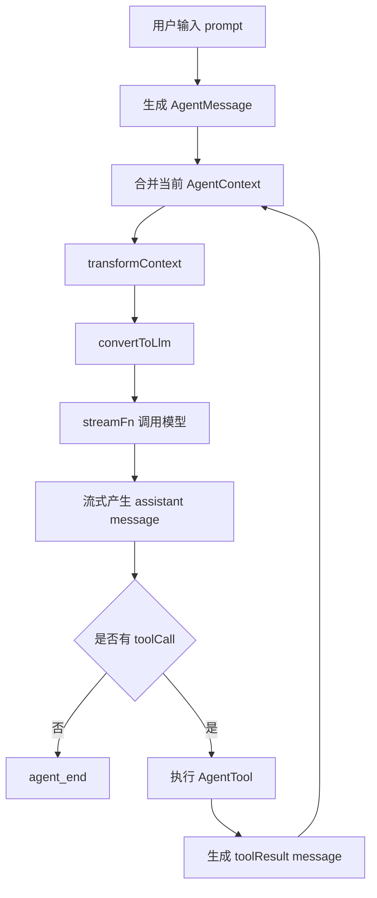

# 基于 pi Agent 框架派生新 Agent 的原理

## 核心结论

基于 pi 派生新 Agent，本质上不是继承某个基类，而是通过组合运行时能力来定义一个新的 Agent：

- 选择模型和推理等级。
- 定义系统提示词。
- 决定可用工具。
- 决定上下文如何进入模型。
- 决定工具调用前后的安全策略。
- 决定会话、扩展、技能、提示模板等外层能力是否保留。

pi 的 Agent 能力分成三层：

| 层级 | 包 | 作用 |
|---|---|---|
| 模型层 | `@earendil-works/pi-ai` | 抽象 OpenAI、Anthropic、Google 等模型提供商，提供统一流式接口。 |
| Agent 核心层 | `@earendil-works/pi-agent-core` | 管理消息、工具调用、状态、事件和 Agent loop。 |
| 编码 Agent 层 | `@earendil-works/pi-coding-agent` | 在核心 Agent 上加入文件工具、会话、AGENTS.md、skills、extensions、TUI/CLI 等能力。 |

因此，派生新 Agent 有两条主路径：

- 用 `pi-agent-core` 直接构造一个通用 Agent。
- 用 `pi-coding-agent` SDK 构造一个保留 pi 编码能力的专用 Agent。

如果要在现有 pi 内部增加专业子 Agent，则使用 extension 加 markdown agent definition。

## Agent loop 原理

`Agent` 的运行核心是一个循环：



关键点：

- `AgentMessage` 是 pi 内部消息类型，可以包含自定义消息。
- `convertToLlm` 负责把 `AgentMessage[]` 转成模型能理解的 `Message[]`。
- `transformContext` 负责在调用模型前裁剪、压缩或注入上下文。
- `streamFn` 是实际模型调用入口，默认使用 `streamSimple`。
- 工具调用由 `AgentTool` 定义，模型只看到工具 schema，执行逻辑在本地运行。
- 每一步都会产生事件，UI、CLI、日志系统和扩展都可以订阅这些事件。

## 路径一：基于 `pi-agent-core` 派生通用 Agent

适用场景：

- 你要做一个独立 Agent 产品。
- 不需要 pi 的文件编辑工具和 TUI。
- 想完全控制 prompt、工具、消息结构和模型调用。

最小结构：

```ts
import { Agent, type AgentTool } from "@earendil-works/pi-agent-core";
import { getModel } from "@earendil-works/pi-ai";
import { Type } from "typebox";

const currentTimeParameters = Type.Object({});

const currentTimeTool: AgentTool<typeof currentTimeParameters, { isoTime: string }> = {
  name: "current_time",
  label: "Current Time",
  description: "Returns the current time as an ISO timestamp.",
  parameters: currentTimeParameters,
  execute: async () => {
    const isoTime = new Date().toISOString();
    return {
      content: [{ type: "text", text: isoTime }],
      details: { isoTime },
    };
  },
};

const model = getModel("anthropic", "claude-sonnet-4-20250514");
if (!model) {
  throw new Error("Model not found");
}

const agent = new Agent({
  initialState: {
    systemPrompt: "你是一个时间助手。回答必须简洁。",
    model,
    thinkingLevel: "medium",
    tools: [currentTimeTool],
  },
});

agent.subscribe((event) => {
  if (event.type === "message_update" && event.assistantMessageEvent.type === "text_delta") {
    process.stdout.write(event.assistantMessageEvent.delta);
  }
});

await agent.prompt("现在几点？");
```

这个路径的派生点：

| 派生点 | 作用 |
|---|---|
| `systemPrompt` | 定义 Agent 身份、边界、输出风格和任务策略。 |
| `model` | 决定默认模型。 |
| `thinkingLevel` | 决定推理强度。 |
| `tools` | 决定 Agent 可以操作什么外部能力。 |
| `convertToLlm` | 支持自定义消息类型或过滤 UI-only 消息。 |
| `transformContext` | 注入项目资料、压缩历史、实现上下文窗口管理。 |
| `beforeToolCall` | 工具执行前做权限、安全或参数检查。 |
| `afterToolCall` | 工具执行后改写结果、记录审计信息或提前终止。 |
| `streamFn` | 接入私有模型网关、代理服务或自定义鉴权。 |

## 路径二：基于 `pi-coding-agent` 派生代码 Agent

适用场景：

- 你想保留 pi 的文件读取、搜索、编辑、bash、会话和项目规则加载。
- 你只想把它改造成某个专门用途的编码 Agent。
- 你希望继续复用 `AGENTS.md`、skills、extensions、slash commands。

最小结构：

```ts
import {
  createAgentSession,
  DefaultResourceLoader,
  getAgentDir,
  SessionManager,
  SettingsManager,
} from "@earendil-works/pi-coding-agent";

const resourceLoader = new DefaultResourceLoader({
  cwd: process.cwd(),
  agentDir: getAgentDir(),
  systemPromptOverride: (basePrompt) => `${basePrompt}

你是数据库迁移审查 Agent。
只关注 schema 兼容性、数据迁移风险、锁表风险和回滚方案。`,
});

await resourceLoader.reload();

const { session } = await createAgentSession({
  resourceLoader,
  tools: ["read", "grep", "find", "ls", "bash"],
  sessionManager: SessionManager.inMemory(process.cwd()),
  settingsManager: SettingsManager.inMemory({
    compaction: { enabled: true },
  }),
});

try {
  session.subscribe((event) => {
    if (event.type === "message_update" && event.assistantMessageEvent.type === "text_delta") {
      process.stdout.write(event.assistantMessageEvent.delta);
    }
  });

  await session.prompt("审查当前迁移文件。");
} finally {
  session.dispose();
}
```

这个路径实际派生的是一个完整 coding agent session：

- `createAgentSession()` 创建 `Agent`。
- `DefaultResourceLoader` 加载系统提示词、AGENTS.md、skills、extensions、prompts、themes。
- `SessionManager` 决定会话持久化。
- `SettingsManager` 决定压缩、重试、传输、模型等设置。
- `tools` 是工具 allowlist，决定启用哪些内置工具和扩展工具。

## 路径三：用 extension 派生专业子 Agent

适用场景：

- 主 Agent 运行时，需要委派任务给多个专业 Agent。
- 例如 `scout` 负责代码侦察，`planner` 负责计划，`reviewer` 负责审查。
- 每个子 Agent 有独立 prompt、工具范围和模型配置。

子 Agent 通常用 markdown 定义：

```md
---
name: db-reviewer
description: Reviews database migrations
tools: read, grep, find, ls
model: claude-sonnet-4-20250514
---

你是数据库迁移审查 Agent。

重点检查：

- schema 兼容性
- 数据迁移风险
- 锁表和性能风险
- 回滚方案
- 是否缺少测试或验证步骤
```

常见位置：

- 用户级：`~/.pi/agent/agents/*.md`
- 项目级：`.pi/agents/*.md`

这种方式不是启动一个不同的主程序，而是在 pi 的 extension 体系里把任务委派给独立上下文的 Agent。

## 派生设计原则

### 1. Prompt 定义职责，不定义实现细节

系统提示词应该约束 Agent 的目标、边界、输出格式和安全规则。

不要把工具执行细节硬塞进 prompt。工具能力应该通过 `tools` 和 extension 暴露。

### 2. 工具决定能力边界

Agent 能做什么，主要由工具决定。

例如：

- 只读分析 Agent：`["read", "grep", "find", "ls"]`
- 可执行诊断 Agent：`["read", "grep", "find", "ls", "bash"]`
- 可修改代码 Agent：`["read", "grep", "find", "ls", "edit", "write", "bash"]`

工具越多，能力越强，风险也越高。

### 3. 上下文转换决定模型看到什么

`transformContext` 和 `convertToLlm` 是派生 Agent 的核心控制点。

常见用途：

- 删除 UI-only 消息。
- 把自定义消息转换成普通 user message。
- 注入外部知识库结果。
- 压缩历史对话。
- 在上下文过长时只保留关键消息。

### 4. Hook 决定安全策略

`beforeToolCall` 适合做执行前拦截：

- 禁止危险命令。
- 限制文件路径。
- 拒绝不符合策略的工具参数。
- 对项目级 Agent 增加确认流程。

`afterToolCall` 适合做执行后处理：

- 重写工具返回给模型的内容。
- 追加审计信息。
- 把敏感信息从结果中移除。
- 根据工具结果提前终止 loop。

### 5. 会话层决定产品体验

如果只用 `Agent`，你需要自己管理：

- 会话保存。
- 用户界面。
- 模型选择。
- 配置文件。
- 项目规则加载。

如果用 `createAgentSession()`，这些能力大多已经存在。

因此，除非你要做完全独立的产品，否则专用编码 Agent 优先使用 `pi-coding-agent` SDK。

## 推荐选择

| 目标 | 推荐方式 |
|---|---|
| 独立通用 Agent | `new Agent()` |
| 专用代码分析 Agent | `createAgentSession()` 加自定义 prompt 和工具 allowlist |
| 只读审查 Agent | `createAgentSession()` 加只读工具 |
| 可执行修复 Agent | `createAgentSession()` 加 `edit`、`write`、`bash` |
| 多 Agent 分工 | extension 加 markdown agent definitions |
| 私有模型网关 | 自定义 `streamFn` |
| 自定义消息协议 | 自定义 `AgentMessage`、`convertToLlm` 和 `transformContext` |

## 最小派生清单

派生一个新的 pi Agent 时，至少明确这些问题：

- 这个 Agent 的唯一职责是什么？
- 它是否允许修改文件？
- 它是否允许执行 shell 命令？
- 它是否需要持久化会话？
- 它是否需要读取 `AGENTS.md` 和 skills？
- 它是否需要接入私有模型或自定义鉴权？
- 它的输出格式是否固定？
- 工具调用前是否需要安全拦截？

回答完这些问题，就能决定使用 `Agent`、`createAgentSession()`，还是 extension 子 Agent。
